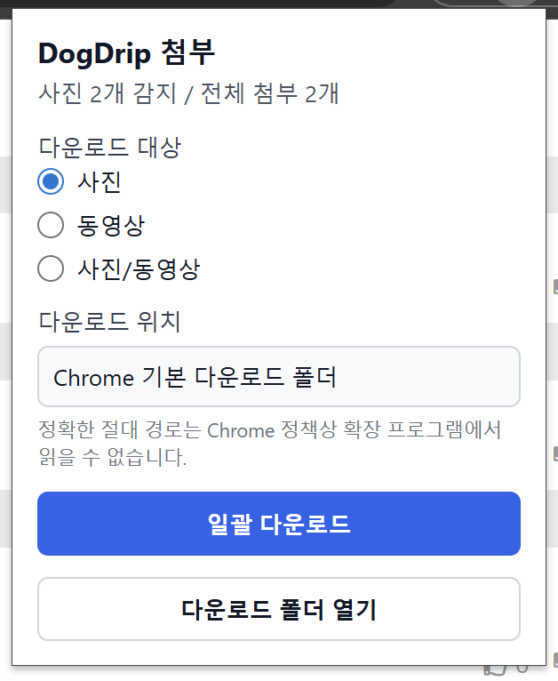

# DogDrip Bulk Downloader

## 소개
**DogDrip Bulk Downloader**는 DogDrip.net(이하 개드립) 게시글에 포함된 첨부 이미지와 동영상을 Chrome 툴바 팝업에서 한 번에 다운로드할 수 있도록 도와주는 Chrome 확장 프로그램입니다.

사용자가 개드립 게시글 탭에서 확장 프로그램 아이콘을 클릭하면, 현재 게시글에 포함된 첨부파일 링크를 감지하고 사진, 동영상, 또는 사진/동영상을 선택해 Chrome 기본 다운로드 기능으로 저장할 수 있습니다.

**※이 확장 프로그램은 DogDrip.net 공식 확장프로그램이 아닌 비공식 보조 도구입니다.※**

**※사용하기 위해서는 DogDrip.net 로그인이 필요합니다.※**

## 주요 기능
- DogDrip 게시글 첨부파일 감지
- 사진 / 동영상 / 사진+동영상 선택 다운로드
- Chrome 기본 다운로드 폴더 저장
- 중복 첨부파일 제거
- 페이지에 별도 UI 삽입 없음

## 사용 예시

 | 
---|---|

#### 1. DogDrip 게시글을 엽니다.
#### 2. Chrome 툴바에서 DogDrip Bulk Downloader 아이콘을 클릭합니다.
#### 3. 다운로드 대상을 선택합니다.
#### 4. 일괄 다운로드 버튼을 누릅니다.
#### 5. Chrome 기본 다운로드 폴더에 첨부파일이 저장됩니다.

## 설치 방법
### Chrome 웹 스토어 설치
Chrome 웹 스토어 등록 후 아래에 링크를 추가할 예정입니다.

## 사용 방법
1. 개드립에 접속합니다.
2. 첨부 이미지나 동영상이 포함된 게시글을 엽니다.
3. Chrome 툴바의 DogDrip Bulk Downloader 아이콘을 클릭합니다.
4. 팝업에서 다운로드할 대상을 선택합니다.

|옵션|설명|
|:---|:---|
|사진|이미지 첨부파일만 다운로드합니다.|
|동영상|동영상 첨부파일만 다운로드합니다.|
|사진/동영상|이미지와 동영상 첨부파일을 함께 다운로드합니다.|

5. 일괄 다운로드 버튼을 클릭합니다.
6. 다운로드가 완료되면 Chrome 다운로드 목록 또는 기본 다운로드 폴더에서 파일을 확인합니다.

## 다운로드 방식
Chrome downloads API를 사용하며, **파일은 압축하지 않고 개별 다운로드**됩니다.

다운로드되는 파일명 앞에는 순서 번호가 붙습니다.

01_example.jpg 
02_example.png 
03_example.mp4 

같은 첨부파일이 중복으로 감지되는 경우, 중복 항목은 자동으로 제외됩니다.

Chrome 확장 프로그램 보안 정책상 기본 다운로드 폴더의 절대 경로는 확장 프로그램에서 직접 읽을 수 없습니다. 따라서 팝업에는 Chrome 기본 다운로드 폴더로 표시되며, 다운로드 폴더 열기 버튼을 통해 실제 폴더를 열 수 있습니다.

Chrome 설정에서 다운로드 전에 각 파일의 저장 위치 확인 옵션이 켜져 있으면 파일마다 저장 위치 확인 창이 표시될 수 있습니다. 일괄 다운로드를 편하게 사용하려면 해당 옵션을 끄는 것을 권장합니다.

## 권한 설명
이 확장 프로그램은 기능 구현을 위해 최소한의 Chrome 확장 권한을 사용합니다.

|권한|사용이유|
|:---|:---|
|activeTab|사용자가 확장 아이콘을 클릭한 현재 DogDrip.net 탭을 확인하기 위해 사용합니다.|
|downloads|사용자가 선택한 첨부파일을 Chrome 다운로드 기능으로 저장하기 위해 사용합니다.|
|scripting|기존에 열려 있던 탭에 콘텐츠 스크립트가 아직 주입되지 않았을 때, 첨부파일 감지 스크립트를 다시 주입하기 위해 사용합니다.|
|host permission(https://www.dogdrip.net/*)|게시글 페이지의 첨부파일 링크를 읽기 위해 사용합니다.|

이 확장 프로그램은 모든 웹사이트에 접근하지 않으며, DogDrip.net 도메인에서만 동작하도록 제한되어 있습니다.

## 개인정보 처리
DogDrip Bulk Downloader는 사용자의 개인정보를 수집하거나 외부 서버로 전송하지 않습니다.
이 확장 프로그램이 처리하는 정보는 다음과 같습니다.

- 현재 개드립 게시글에 표시된 첨부파일 링크
- 첨부파일 이름
- 첨부파일 확장자
- 현재 페이지 제목

위 정보는 브라우저 내부에서 첨부파일을 감지하고 다운로드 목록에 추가하기 위해서만 사용됩니다.

이 확장 프로그램은 다음 정보를 수집하지 않습니다.

- 로그인 정보
- 쿠키
- 비밀번호
- 결제 정보
- 개인 식별 정보
- 방문 기록
- 사용자의 파일 내용
- 광고 식별자
- 분석 또는 추적 데이터

또한 외부 서버, CDN, 원격 스크립트에서 코드를 다운로드하거나 실행하지 않습니다.

모든 JavaScript, HTML, CSS 파일은 확장 프로그램 패키지 내부에 포함되어 있습니다.

## 제한 사항
현재 버전에는 다음과 같은 제한이 있습니다.

- DogDrip.net 로그인이 필요합니다.
- 게시글 페이지에서만 동작합니다.
- 개드립 사이트 구조가 변경되면 첨부파일 감지가 정상적으로 동작하지 않을 수 있습니다.
- Chrome 다운로드 설정에 따라 파일마다 저장 위치 확인 창이 표시될 수 있습니다.
- Chrome 확장 프로그램 보안 정책상 다운로드 폴더의 절대 경로는 표시하지 않습니다.
- 일부 첨부파일은 파일명이나 확장자 정보가 부족할 경우 unknown 또는 임시 파일명으로 감지될 수 있습니다.

## 문제 해결
### 확장 프로그램 팝업이 계속 로딩 중인 경우
아래 순서대로 확인해 주세요.
1. 게시글 탭을 새로고침합니다.
2. 확장 프로그램 팝업을 다시 엽니다.
3. 그래도 동작하지 않으면 chrome://extensions에서 확장 프로그램을 새로고침합니다.

### 첨부파일이 감지되지 않는 경우
- 현재 페이지가 DogDrip 게시글 페이지인지 확인합니다.
- 게시글에 실제 첨부 이미지나 동영상이 포함되어 있는지 확인합니다.
- 게시글을 새로고침한 뒤 다시 시도합니다.

### 다운로드가 시작되지 않는 경우
- Chrome 오른쪽 위 다운로드 목록을 확인합니다.
- 저장 위치 확인 창이 열려 있는지 확인합니다.
- Chrome 다운로드 설정에서 다운로드 전에 각 파일의 저장 위치 확인 옵션이 켜져 있는지 확인합니다.

## 프로젝트 구조
DogDrip_Bulk_Downloader/ 
├── manifest.json 
├── background.js 
├── content.js 
├── popup.html 
├── popup.css 
├── popup.js 
├── icons/ 
└── README.md

## 개발 환경
- Chrome Extension Manifest V3
- JavaScript
- HTML
- CSS
- Chrome Extensions API
  - activeTab
  - downloads
  - scripting

## 버전 기록
v0.1.4
- 사진, 동영상, 사진/동영상 선택 다운로드 지원
- DogDrip 첨부파일 링크 감지
- 중복 파일 제거
- Chrome 기본 다운로드 폴더 저장
- 다운로드 폴더 열기 기능 추가
- 기존 탭에서 콘텐츠 스크립트가 없을 경우 자동 재주입 처리
- 개인정보 수집 없는 구조로 정리

## 면책 조항
이 확장 프로그램은 DogDrip 공식 확장 프로그램이 아닙니다.

DogDrip Bulk Downloader는 사용자가 직접 열람 중인 DogDrip 게시글의 첨부파일을 더 편하게 다운로드할 수 있도록 만든 비공식 보조 도구입니다.

DogDrip 사이트 구조나 정책 변경에 따라 일부 기능이 동작하지 않을 수 있습니다.

## 라이선스
이 프로젝트는 MIT License를 따릅니다.

MIT License

Copyright (c) 2025 DogDrip Bulk Downloader Contributors

Permission is hereby granted, free of charge, to any person obtaining a copy
of this software and associated documentation files (the "Software"), to deal
in the Software without restriction, including without limitation the rights
to use, copy, modify, merge, publish, distribute, sublicense, and/or sell
copies of the Software, and to permit persons to whom the Software is
furnished to do so, subject to the following conditions:

The above copyright notice and this permission notice shall be included in all
copies or substantial portions of the Software.

THE SOFTWARE IS PROVIDED "AS IS", WITHOUT WARRANTY OF ANY KIND, EXPRESS OR
IMPLIED, INCLUDING BUT NOT LIMITED TO THE WARRANTIES OF MERCHANTABILITY,
FITNESS FOR A PARTICULAR PURPOSE AND NONINFRINGEMENT. IN NO EVENT SHALL THE
AUTHORS OR COPYRIGHT HOLDERS BE LIABLE FOR ANY CLAIM, DAMAGES OR OTHER
LIABILITY, WHETHER IN AN ACTION OF CONTRACT, TORT OR OTHERWISE, ARISING FROM,
OUT OF OR IN CONNECTION WITH THE SOFTWARE OR THE USE OR OTHER DEALINGS IN THE
SOFTWARE.
